<h1> Prequals CTF National 2024 </h1>

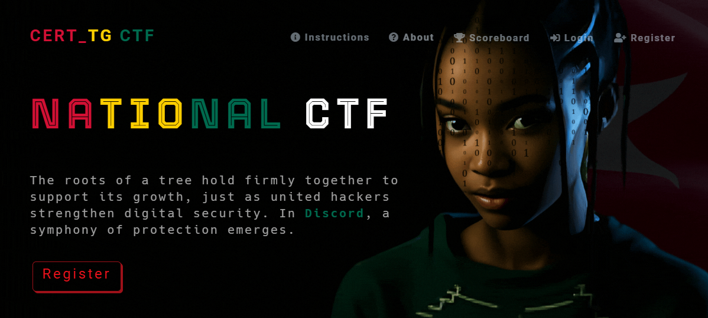

J’ai participé récemment au CTF National du Togo sous le pseudo de `3ss0w7r30u` avec ma team `n0_m3rcy_f0r_th3m !!`. Voici un aperçu du SCOREBOARD à la fin du CTF :

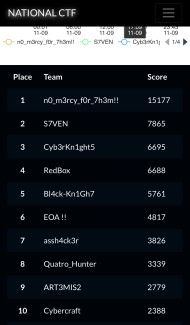

Nous occupons donc ainsi la première place de cette phase de préqualification. La finale sera tout aussi palpitante !


Avant de commencer, je tiens à remercier avant tout toute mon équipe, qui ont travaillé d’arrache-pied pour qu’on puisse occuper la première place. Mes remerciements vont particulièrement à l’ANCY et à la CDA sans oublier les créateurs de challenges (`Isid0r3`, `Sergio`, `H13ris`, `assa` et `44r0n_M3T4`).

Je commencerai avec les challenges PWN qui m’ont particulièrement intéressé, je rappelle que j’ai fait un First Blood 🩸 ( Le premier à solve un challenge ) sur tous les challenges PWN qui ont été release. J’en suis particulièrement fier !

Voici la liste des challenges PWN qui ont été release :

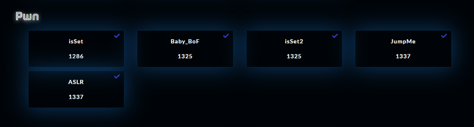

#### PWN
- isSet
- isSet2
- ASLR
- JumpMe
- Baby_Bof

### Attention !

    Il s’agit d’un writeup, je ne tiens pas à faire un cours sur le PWN parce que je considère que c’est la compétence avec le plus de barrière à l’entrée parmi les types de challenges du format JEOPARDY, il se peut donc que certaines notions vous paraissent flou si vous n’avez pas le minimum requis. Si je devais expliquez chaque notion, je pense que j’écrirai un article de plusieurs pages et non un write-up.

Malheureusement toutes les instances ont été stoppés, donc les challenges seront résolus en local.

#### isSet [ First Blood 🩸] :

Le but principal d’un challenge PWN est d’exploiter des vulnérabilités liées à un binaire (exécutable) dans le but de détourner le programme de son but principal, et même obtenir un Shell distant.

La première des choses est de voir à quel type de binaire nous avons affaire, avant de commencer assurer vous d’avoir la bibliothèque pwntools d’installer. Pour ce writeups, je n’utiliserai pas de scripts pwntools autogénéré pour que le code soit compréhensible par les moins habitués au challenge.

Nous avons un fichier qui accompagne le challenge, nous le télechargesons et pour commencer, nous devons savoir à quel type de fichier nous avons à faire avec la commande file :

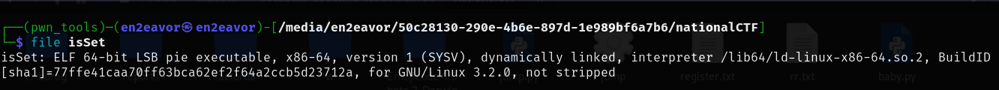

Il s'agit d'un ELF 64 bits ce qui influence la taille des adresses et le type d'instructions utilisées ( important pour la suite ), `dynamically linked` c'est à dire que que le programme utilise des bibliothèques dynamiques, qui ne sont pas intégrées dans le binaire mais chargées lors de son exécution et pour finir `not stipped`, en gros le binaire contient des symboles de débogage et des informations sur les fonctions et variables (par exemple, les noms de fonctions) ce qui facilite grandement son analyse !

Avant de poursuivre, comme je l'ai dit le pwn consisite à exploiter des failles dans les binaires pour atteindre un objectif particulier. Au cours des décenies, plusieurs protections appelées `mitigations` ont été mise en places pour éviter ces exploitations. Pour voir les protections appliquées à notre binaire, nous utiliserons l'outil `checksec`

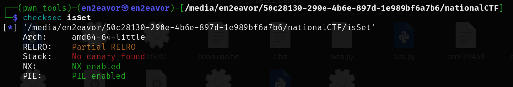

On a deux protections actives :
- NX enabled : La stack n'est pas éxécutable
- PIE enabled : Les adresses des fonctions dans le binaire sont rendomisés à chaque exécution

Essayons d'éxecuter le binaire pour voir comment il fonctionne :

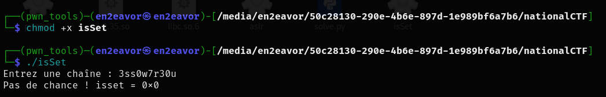

D'abord, 
- On lui accorde les droits d'exécution
- Puis on passe à l'éxécution

Le programme, nous demande d'entrer une chaine et ensuite on a le texte : Pas de chance !

Mais on a pas assez d'informations sur le fonctionnement du programme, nous allons donc le décompiler, c'est à dire retrouver le code d'origine du binaire en utilisant l'outil `Ghidra` ( Vous pouvez utilisez les outils qui vous semble familier ) :

En observant la fonction main :

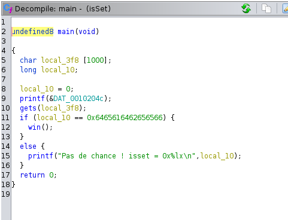

Nous observons du code écris en langage en C :

```c
undefined8 main(void)

{
  char local_3f8 [1000];
  long local_10;
  
  local_10 = 0;
  printf(&DAT_0010204c);
  gets(local_3f8);
  if (local_10 == 0x6465616462656566) {
    win();
  }
  else {
    printf("Pas de chance ! isset = 0x%lx\n",local_10);
  }
  return 0;
}
```
On remarque donc que :
- On a un buffer `local_3f8` avec une taille de 1000 bytes
- Ensuite une variable `local_10` initialisé à 0
- Un texte est affiché avec la fonction `printf` ( il s'agit du texte nous demandant d'entrer une chaine lorsqu'on éxecute le programme codé en dur ...)
- On récupère l'information avec la fonction `gets` dans le buffer `local_3f8` sans resteindre le nombre de caracrères que l'utilisateur peut entrer, ce qui s'avère très dangereux et peut permettre un buffer overflow !
- Ensuite il y'a une comparaison qui est faite entre la variable `local_10` et la valeur `0x6465616462656566`. Si la condition est respecté, la fonction `win` est appelé. Dans le cas contraire, le texte : `Pas de chance ! isset` est affiché.
- `win` signifie littéralement gagner, donc je suppose que c'est l'objectif du challenge, passez la condition pour atteindre la fonction `win`. Maiq eu contient la fonction `win` ? Utilisez Ghidra pour le trouver :

  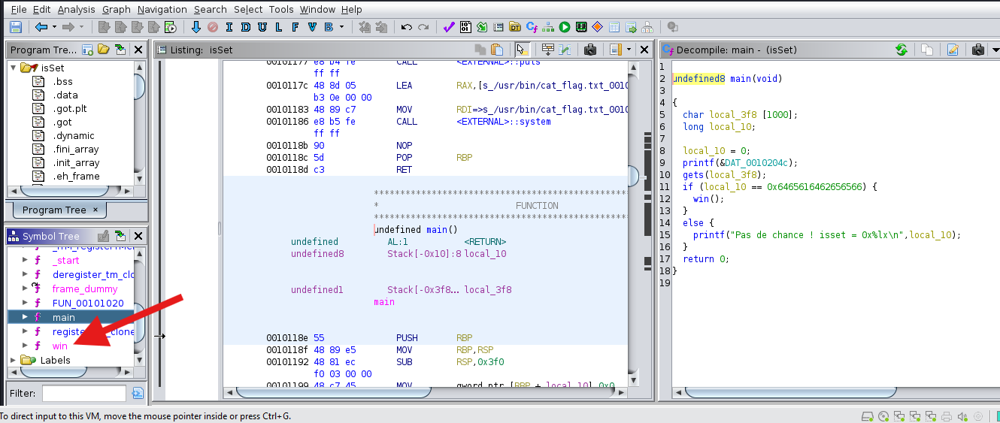

  Cliquez dessus comme la figure ci-dessus 

  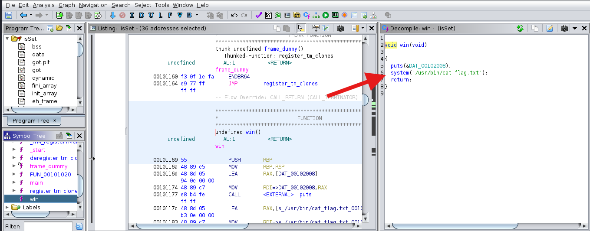

  Comme on peut l'observer la fonction `win` nous affiche le flag !

Quels sont les problèmes avec ce code ??
- D'abord, le fait qu'on ne limite pas l'entrée de l'utilisateur, ce qui cause un buffer overflow
- Ensuite que le check qui est fait avec la condition `if` n'a aucun sens !!! La varaible `local_10` est déclaré et initialisé à 0, nous n'avons donc aucun moyen logique de modifier sa valeur pour que la condition soit respecté. Nous sommes donc dans une impasse ! Si le check était fait avec la variable `local_3f8`, nous aurions pu passer la condition en éxécutant le programme et en entrant `0x6465616462656566`

Comment allons nous nous y prendre alors ?

- Nous allons exploiter la faille du buffer overlow comme décrite précedemment pour modifier la variable `local_10` en mémoire !

Pour ce faire, il faut comprendre l'alignement des vaiables dans la stack, je vous invite à ouvrir Ghidra pour que ce soit plus facile à comprendre :

Revenez à la fonction main

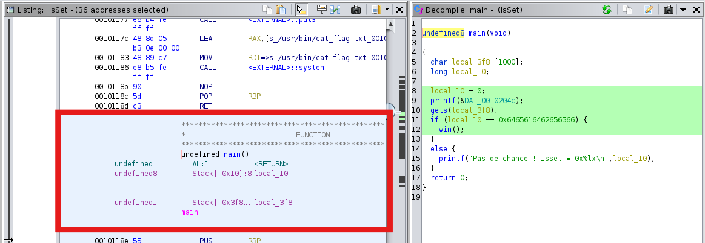

Observez à ce niveau, l'alignement des variables dans la stack !
Nous avons du bas vers le haut :

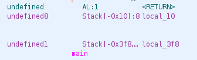

- `local_3f8`
- `local_10`

Je suis de bonne humeur, je vais vous faire une petite représentation pour votre compréhension :

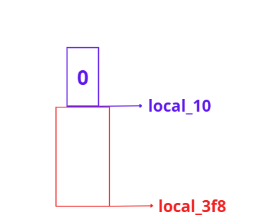

Au début du programe, voilà comment les variables sont représentées,`local_3f8` est vide et `local_10` vaut 0. Notre but c'est de modifier la valeur de `local_10` pour qu'elle ait la veleur de `0x6465616462656566` pour ainsi réussir le check et accéder à la valeur win.

Lors que nous exécuter le programme et que nous entrons une chaine comme ceci :


Voilà à quoi ressemble la stack :

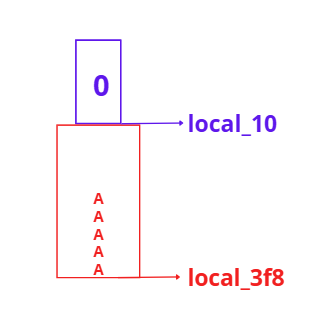

Ici, je n'ai entrée que 5 caractères A, n'oubliez pas que la varaible `local_3f8` peut contenir jusqu'à 1000 caractères. Notre but est donc de remplir  `local_3f8` pour déborder sur `local_10` pour entrer la valeur voulu. Bien sur ce n'est possible que parce qu'on une vulnérabilité de type buffer overflow qui est dûe au fait que le programme ne limite par l'entrée de l'utilisateur !

Si je veux par exemple modifier la valeur de `local_10` en `1111`, je vais devoir remplir `local_3f8` pour atteindre `local_10` et ensuite rentrer `1111`. Comme le montre cette figure :

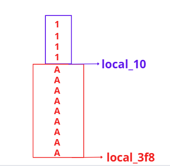

Mais la question qui se pose, combien de `local_10` je vais devoir entrer ? 5 ? 10? 100 ? 1000 ? La vrai question quel est la taille qui sépare `local_3f8` de `local_10`.

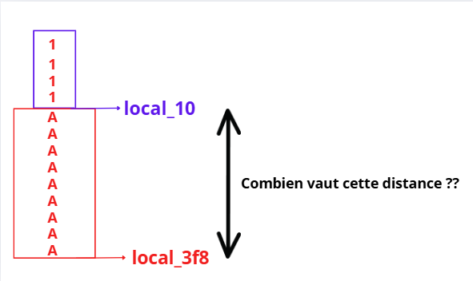

Cette distance est encore appelé offset !

Pour la connaitre, reprennez cette image de Ghidra :


Zoomons : 

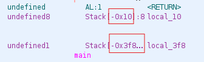

Il suffit de faire la différence entre `0x10` et `0x3f8`. Ce qui donne : 
- `0x3f8` - `0x10` = `1000`

Il faudra donc entrer `1000` fois le caractères `A` pour atteindre `local_10`. Une fois, il suffira d'entrer maintenant la valeur que l'on veut pour `local_10`. Dans notre cas cette valeur sera : `0x6465616462656566`.

Deux méthodes de résolution s'offrent à nous, écrire un script ou tout simplement, utilisez le terminal

- Utilisation du terminal Linux

  Nous allons utilisez python pour envoyez les 1000 caractères A pour atteindre `local_10` et ensuite écrire la valeur `0x6465616462656566` dans `local_10`. Une petite subtilité s'impose quand nous allons envoyer `0x6465616462656566`. Le système Linux fonctionne sur du little endian, donc la donnée doit etre envoyée sous ce format ( je vous invite à vous renseignez dessus ! )

  ```bash
  ┌──(pwn_tools)─(en2eavor㉿en2eavor)-[nationalCTF]
  └─$ python -c 'print("A"*1000 + "\x66\x65\x65\x62\x64\x61\x65\x64")' | ./isSet
  Entrez une chaîne : Bravo ! Vous avez appelé la fonction win() !
  FLAG{********FLAG-REDACTED********}
  ```

Voici donc le script de fin qui sera utilisé pour atteindre mon but :

```python
from pwn import *

target = process("./isSet")
#target = remote("playground.ctf.tg", 1237)

offset = 1000

'''
On laisse le programme s'executer jusqu'à 
qu'à la fin du message, "Entrez une chaîne : "

Ici je ne mets pas tout le texte à cause de la présence des accents
'''
target.recvuntil(b"ne : ")

'''
Je construis le payload, comme dit précedemment, je remplis la variable local_3f8 jusqu'à la variable local_10 puis je rentre la nouvelle valeur de local 10 que je veux, dans mon cas : 0x6465616462656566. J'utilise p64 ici car les instructions envoyés au système sont toujours en little endians ( googlez dessus !)
'''
payload = b"A"*offset
payload += p64(0x6465616462656566)

'''
Envoie du payload final
'''
target.sendline(payload)


target.interactive()

```


